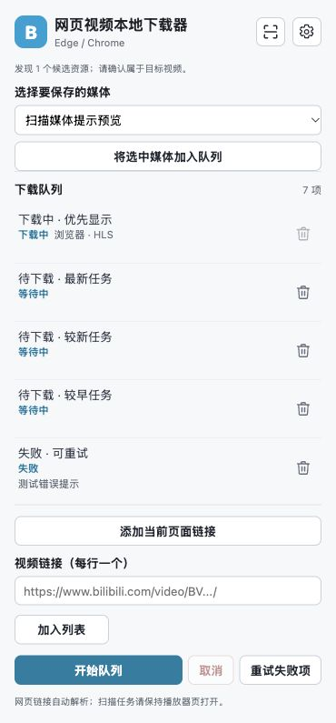

# 网页链接自动解析 1.4.0

直接输入网页链接并启动队列，Host 使用普通 HTTP 读取页面与 iframe，找到媒体资源并下载，无需打开对应网站。Bilibili 等站点保留 yt-dlp 专用提取器；本次仅替换通用提取器的网页发现阶段。提取与下载使用 [yt-dlp 官方嵌入接口](https://github.com/yt-dlp/yt-dlp#embedding-yt-dlp)。

支持 HTML video/source（包括无扩展名 src）、VideoObject contentUrl/embedUrl、公开 HLS/DASH 字面值及实际用于播放器 url/src/loadSource 的简单变量赋值。脚本中未被用于视频源的 MP4，例如 adposter，不自动下载。页面标题沿用为文件名，并通过 Host 元数据事件更新队列标题。多项同优先级资源停止自动选择，提示扫描页面后人工选择。请求保留所在页面的 Referer，不导入浏览器凭据、不执行 JS 或解码私有播放参数。

本地扫描最多 8 个页面、iframe 嵌套 3 层、每页 2 MB；拒绝本地地址、URL 中的账号密码、非 HTTP(S) 资源。已有加密/DRM/直播及访问拒绝检查覆盖此下载链路。此功能不需要额外浏览器网站权限；原浏览器扫描方式和传输行为继续保留。

## 验证（2026-10-04）

- 27 项 Python 测试通过。生成实际 MP4、HLS 和 DASH，通过网页链接下载并用 FFmpeg 完整解码验证。新增覆盖网页 → iframe → 内联播放器变量 → HLS，顶层单集标题保留、正确 Referer、adposter 排除、无扩展名 video、VideoObject、多个资源停止、深度和循环边界；Bilibili 专用提取器优先级保持。
- Node 验证 Host 元数据回写、1.4.0 能力要求和旧 Host 提示，同时回归原有浏览器匿名分块传输、权限、取消及队列交互。
- Agedm 实际链接 `https://www.agedm.io/play/20230189/2/1`：未打开网站，通过工具读取 HTML 和 iframe，找到 `vip.ffzyread.com` 的公开 HLS，识别正确的单集名称。随后 CDN 拒绝本机媒体请求，返回 HTTP 403，正文表明地区拒绝；无完整视频，临时 .part 为 0 字节。停止，没有换代理、访问身份或浏览器传输重试。

Agedm 此线路的独立 HTTP 下载未通过，之前已验证的浏览器扫描传输仍需保持播放器页面打开。不能把“解析到媒体”视为“下载成功”。必须执行页面 JS 或依赖浏览器传输的其他站点也可能需要原扫描方式。

macOS arm64 完整包已重新编译。已注册 Host 保留现有 Chrome 扩展 ID 与权限，更新为 1.4.0；安装后的二进制握手、page_scan 能力声明和非法 URL 拒绝通过。前端源码与各压缩包同步更新，Chrome 需用户手动重新加载扩展。

