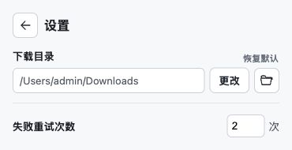

# 弹窗 1.3.1 验证

日期：2026-10-04。扩展 1.3.1 兼容已安装的 Native Host 1.3.0，无需重装 Host。

## 本次改动

- 扫描不再收集仅出现在脚本配置里的 DIRECT 地址。当前 AGE 播放器的第二项来自 `adposter.mp4` 配置，实际 video.currentSrc 是另一条无扩展名的视频地址；实际视频、source、链接及已请求资源仍可发现，脚本 HLS/DASH 清单仍可作为 blob 播放器的候选。
- 扫描选项显示视频页面名称，添加到队列时沿用同一名称。多个候选保留资源序号以便区别，媒体类型和 URL 放在选项提示中。
- 链接输入框默认一行，按内容增高到最多 5.5 行，超出后内部滚动，清空后恢复一行。
- 右上角设置按钮打开弹窗内的设置页，左上角箭头返回。目录选择、打开目录、恢复默认和失败重试次数集中在设置页；重试次数保存到浏览器本地存储。
- 完成项显示录像机图标，沿用默认播放器及 Ctrl + 点击选择其他应用的行为。
- 队列所有行固定操作列，播放图标在左、垃圾桶在右，完成及失败项对齐。

## 验证结果

`node tests/test_extension.cjs` 通过，覆盖脚本占位 MP4 排除、无扩展名实际视频保留、扫描与入队名称一致、重试设置保存与队列传递，以及既有匿名媒体传输、背压、权限和 Host 兼容性。

使用真实 HTML/CSS/JS 和模拟 Chrome API 在本机浏览器预览，确认自动扫描一个候选、添加成功按钮反馈、入队名称一致、旧添加提示不显示、设置页进入及返回、重试次数修改、图标顺序与对齐。七条队列的可视高度为 320px、内容高度为 448px，超过五条内部滚动。输入框空值高度约 32.2px、两行 50px、七行输入时封顶约 114.1px 并滚动。

截图使用测试任务与模拟下载路径，不代表本次实际下载。已安装 Chrome 扩展需用户重新加载，才能验证真实扩展的新界面；本次未重新下载远程视频，先前 AGE 完整下载验证见 `agedm-download-validation.json`。

